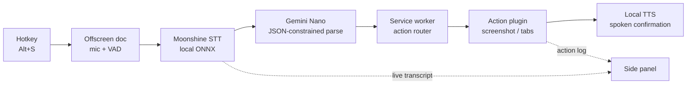

# Sotto

> *sotto voce* — "in a quiet voice." Talk to your browser; nothing you say ever leaves your machine.

[](LICENSE)
[](#requirements)
[](#contributing)
[](#privacy-model)

Sotto is an open-source Chrome extension (Manifest V3) that turns speech into browser actions and spoken responses using **only on-device models**:

- **Speech-to-text** — [Moonshine](https://github.com/usefulsensors/moonshine) running locally via ONNX (WebGPU, WASM fallback)
- **Understanding** — Gemini Nano through Chrome's built-in [Prompt API](https://developer.chrome.com/docs/ai/prompt-api)
- **Text-to-speech** — your OS's local voices

No API keys. No server. No telemetry. The only network traffic is a one-time model download.

**Status: v0.1 — pipeline proof.** Push-to-talk → local STT → Nano intent parsing → screenshot & tab-control actions → spoken confirmation.

---

## What you can say

| You say | Sotto does |
|---|---|
| "take a screenshot" | Captures the visible tab to your clipboard |
| "screenshot this and send it to my Claude chat" | Captures, copies, focuses claude.ai — paste-ready |
| "new tab" / "close this tab" | Tab control |
| "switch to the GitHub tab" | Nano extracts the target from your words; deterministic local code fuzzy-matches it against open tabs — tab titles never enter the model |
| "mute that video" / "reopen what I just closed" | Tab audio & session restore |
| *(anything it doesn't know)* | "Sorry, say that again?" — it never guesses |

## How it works



The model only ever **chooses** from a whitelist of actions and fills in their parameters — every Nano call is constrained by a JSON Schema composed from the registered actions. It cannot invent capabilities. All execution is plain, auditable extension code.

## Privacy model

- **Zero runtime network.** Every inference — STT, understanding, TTS — happens on-device. Open DevTools, watch the network log while you use it: it's empty. That's the project's trust signature.
- **Voice-only command channel.** The intent parser only ever sees your transcript. Page content never enters it, so a webpage cannot inject commands.
- **Schema-constrained output.** Nano physically cannot emit an action outside the registry, and the router validates again anyway.
- **No audio retention.** Mic buffers are transient; nothing is written to disk. Transcripts are session-local.
- **Least privilege, honestly stated.** Install-time permissions are minimal; `tabs` is requested only because tab search needs titles. Screen capture is the exception: Chrome's `captureVisibleTab` accepts nothing narrower than the all-sites grant, so onboarding asks for it **once**, it's used only by the screenshot action, and the image never leaves your machine.

## Requirements

| Tier | Needs | You get |
|---|---|---|
| **Full** | Chrome 138+, Gemini Nano available, WebGPU | Everything |
| **Degraded** | No WebGPU | STT on WASM (slower), everything else unchanged |
| **No Nano** | `LanguageModel.availability() === 'unavailable'` | Honest onboarding screen with a hardware/flags checklist — never a silent cloud fallback |
| **No mic** | Permission denied | Type commands in the side panel; same pipeline |

Gemini Nano's rough hardware floor: a recent desktop, ~4 GB VRAM, ~22 GB free disk for the model. See Chrome's [built-in AI requirements](https://developer.chrome.com/docs/ai/get-started).

## Install (from source)

```bash
git clone https://github.com/0xinBeta/Sotto.git
cd Sotto
pnpm install
pnpm build
```

1. Open `chrome://extensions`, enable **Developer mode**
2. **Load unpacked** → select `apps/extension/dist`
3. Open the Sotto side panel and follow onboarding — one visit grants everything: screen capture (one-time), mic access, and model downloads
4. Press <kbd>Alt</kbd>+<kbd>S</kbd> (<kbd>Option</kbd>+<kbd>S</kbd> on macOS), speak, and pause — voice activity detection ends the capture, or press the hotkey again

## Repository layout

```
apps/extension/       MV3 shell: manifest, service worker, offscreen doc, side panel
packages/core/        pipeline orchestration, action registry, messaging
packages/stt/         SttEngine interface + Moonshine implementation
packages/tts/         TtsEngine interface + system-voice implementation
packages/nano/        Prompt API wrappers, availability gating, schema composer
packages/actions/     one folder per utility — the contribution unit
packages/destinations/ copy / claude / …
evals/                intent-parsing cases: transcript → expected JSON
```

## Contributing

The contribution unit is **an action**: a self-contained ~100-line plugin that declares its JSON-schema slice, few-shot examples, and an `execute` function. Adding one never touches core.

Easiest first PRs, no code required: add phrasing cases to `evals/` — every way a human might say "take a screenshot" makes the parser better.

## Roadmap

- **v0.2** — six-utility release: summarize & read aloud, ask-the-page, voice typing & rewrite, notes & reminders; evals CI
- **v0.3** — premium local voice (Kokoro-82M), barge-in, follow-up context
- **v0.4** — opt-in wake word, multimodal ("what's this chart?")
- **v1.0** — Web Store stable, i18n, community action marketplace

## License

Sotto's source is [MIT](LICENSE). The built extension bundles third-party components under their own licenses — notably the eSpeak NG phonemizer (GPL-3.0-or-later, WebAssembly, used by the premium local voice). See [THIRD_PARTY_NOTICES](THIRD_PARTY_NOTICES).
